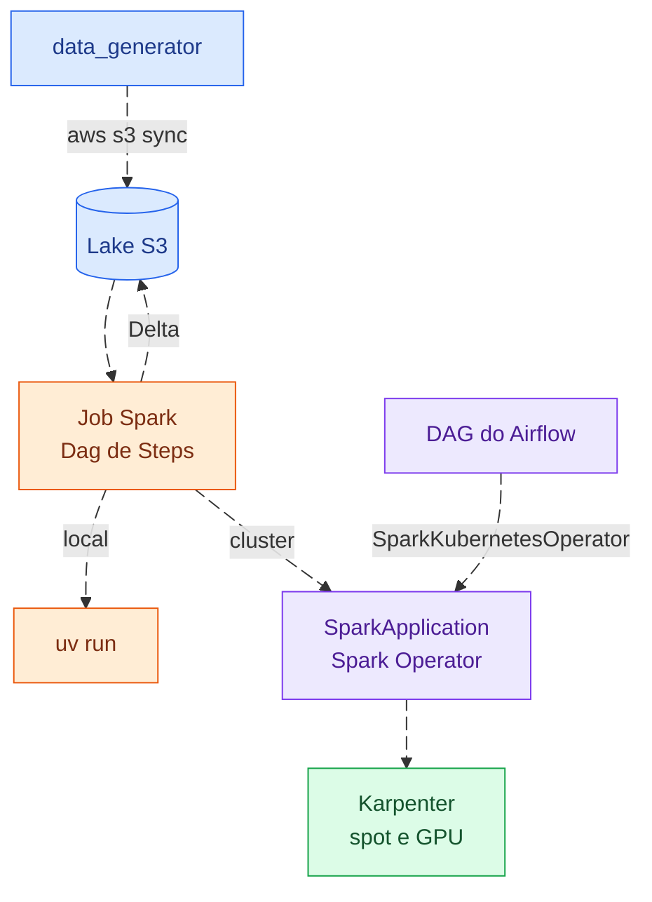

# project-pipeline-distribuited-spark-EKS

Estudo de Spark em Kubernetes. O mesmo job roda local, no EKS (*Elastic Kubernetes
Service*) ou pelo Airflow. No cluster, o Karpenter cria máquinas spot e com GPU
(*Graphics Processing Unit*) só enquanto o job roda, e os dados ficam em Delta no
S3 (*Simple Storage Service*).



## Rodar local

Precisa de [uv](https://docs.astral.sh/uv/) e Java 17; o devcontainer traz os dois.
Sem AWS.

```bash
uv sync
uv run python process/src/data_generator/generate.py stocks_b3 --start_year 2020 --end_year 2024
uv run python -m process_etl.stocks_b3.main
```

## Pipelines

| Job                   | O que faz                               | Roda em |
| --------------------- | --------------------------------------- | ------- |
| `shopping_amazon`     | deduplica `shopping_amazon_reviews` e   | GPU     |
|                       | grava Delta por mês                     |         |
| `stocks_b3`           | indicadores técnicos das ações da B3    | CPU     |
| `xgboost_shopping`    | treina XGBoost para atraso de entrega   | CPU/GPU |
| `spark_pipe_shopping` | legado: lê `shopping` e mostra o schema | CPU/GPU |

CPU é *Central Processing Unit*; B3 é *Brasil, Bolsa, Balcão*. Datasets no
[README do data_generator](process/src/data_generator/README.md).

## Rodar no cluster

Com a [infraestrutura](infrastructure/README.md) de pé:

```bash
aws login
```

1. Dados no lake (espelha `process/src/datasets/`):

   ```bash
   aws s3 sync process/src/datasets/ s3://kube-system-lake/
   ```

2. Imagem no ECR (*Elastic Container Registry*). A tag é imutável: código novo,
   tag nova.

   ```bash
   REGISTRY=$(aws sts get-caller-identity --query Account --output text).dkr.ecr.us-east-1.amazonaws.com
   IMAGE=${REGISTRY}/kube-system-experiment/spark:1.0.0

   aws ecr get-login-password --region us-east-1 \
     | docker login --username AWS --password-stdin "${REGISTRY}"

   docker build --platform linux/amd64 \
     --file process/src/process_etl/spark_pipe_shopping/images/cpu/Dockerfile \
     --tag "${IMAGE}" process/src

   docker push "${IMAGE}"
   ```

3. Disparar, depois de trocar `ACCOUNT_ID` no yaml:

   ```bash
   kubectl apply -f process/src/process_etl/spark_pipe_shopping/sparkapplication.yaml
   kubectl logs -n spark-jobs shopping-etl-driver -f
   ```

   Para rodar de novo, apague antes:
   `kubectl delete sparkapplication shopping-etl -n spark-jobs`.

### Pelo Airflow

As DAGs (*Directed Acyclic Graphs*) ficam em `process/src/airflow/` e chegam ao
Airflow a cada push na `main`.

## Estrutura

| Pasta                         | O que tem                                |
| ----------------------------- | ---------------------------------------- |
| `process/src/library/`        | `Dag`, `Step` e `build_spark`            |
| `process/src/process_etl/`    | jobs de ETL (*Extract, Transform, Load*) |
| `process/src/process_ml/`     | treino de modelos                        |
| `process/src/data_generator/` | download dos datasets                    |
| `process/src/images/`         | imagens Spark com Delta, S3 e RAPIDS     |
| `process/src/airflow/`        | DAGs do Airflow                          |
| `infrastructure/`             | EKS, Karpenter, lake e serviços          |

## GPU

| Imagem         | Dockerfile                    | O que acelera          |
| -------------- | ----------------------------- | ---------------------- |
| `spark-rapids` | `images/base-gpu-rapids`      | Spark SQL inteiro, sem |
|                |                               | mudar código           |
| `spark-gpu`    | `xgboost_shopping/images/gpu` | só o XGBoost, com      |
|                |                               | `device="cuda"`        |

Imagem de CPU no NodePool `spark-gpu` roda sem erro, mas a GPU fica parada.
Confira:

```bash
kubectl logs -n spark-jobs <job>-exec-1 | grep -i "rapids\|cuda\|gpu"
```

## Quando algo dá errado

```bash
kubectl describe pod -n spark-jobs <pod>
```

| Sintoma                         | Causa provável                            |
| ------------------------------- | ----------------------------------------- |
| `untolerated taint`             | Falta a toleration no manifesto           |
| `Pending` por mais de 5 min     | Limite de CPU do NodePool ou sem spot     |
| `pods is forbidden`             | `serviceAccount` diferente de `spark`     |
| `ImagePullBackOff`              | Tag inexistente no ECR                    |
| `exec format error`             | Imagem ARM: build sem `--platform`        |
| `python: can't open file`       | `mainApplicationFile` fora da imagem      |
| `OOMKilled` (*Out Of Memory*)   | Aumente `memory` do executor              |

Job Python ganha 40% de memória extra: `memory: 8g` vira ~11,2Gi por pod.
