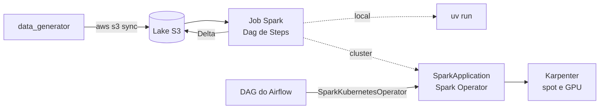

# project-pipeline-distribuited-spark-EKS

Pipelines Spark que rodam do mesmo jeito no seu notebook, num cluster EKS
(*Elastic Kubernetes Service*) e orquestrados pelo Airflow, sem mudar o código.

O que o projeto mostra:

- **Um código, três ambientes.** O job é um `Dag` de `Step`s da `library`. A
  sessão Spark descobre sozinha se está local ou no Kubernetes.
- **Máquinas só quando há trabalho.** O Karpenter sobe EC2 (*Elastic Compute
  Cloud*) spot para os executors e GPU (*Graphics Processing Unit*) para os jobs
  acelerados com RAPIDS, e desliga tudo quando o job termina.
- **Lake de dados no S3** (*Simple Storage Service*) em Delta Lake, que sobrevive
  ao cluster ser destruído.
- **Infraestrutura inteira em dois comandos**: `apply.sh` e `destroy.sh`.

## Como as peças se ligam



## Rodar local em 3 passos

Precisa de [uv](https://docs.astral.sh/uv/) e Java 17. O devcontainer em
`.devcontainer/` já traz os dois. Todos os comandos rodam da raiz.

```bash
uv sync
uv run python process/src/data_generator/generate.py stocks_b3 --start_year 2020 --end_year 2024
uv run python -m process_etl.stocks_b3.main
```

O primeiro comando instala as dependências. O segundo baixa as cotações de 2020
a 2024 da B3 (*Brasil, Bolsa, Balcão*) para `process/src/datasets/`. O terceiro calcula os
indicadores e grava em Delta ao lado do dado bruto. Nada disso usa AWS. Na
primeira execução o Spark baixa os jars do Delta, então precisa de internet.

## Pipelines

Cada job roda em CPU (*Central Processing Unit*) ou em GPU:

| Job                   | O que faz                               | Roda em |
| --------------------- | --------------------------------------- | ------- |
| `shopping_amazon`     | deduplica `shopping_amazon_reviews` e   | GPU     |
|                       | grava Delta por mês                     |         |
| `stocks_b3`           | indicadores técnicos das ações da B3    | CPU     |
| `xgboost_shopping`    | treina XGBoost para atraso de entrega   | CPU/GPU |
| `spark_pipe_shopping` | legado: lê `shopping` e mostra o schema | CPU/GPU |

O `shopping_amazon` usa RAPIDS (`build_spark(gpu=True)`), então precisa de GPU
inclusive local. Os datasets e seus tamanhos estão no
[README do data_generator](process/src/data_generator/README.md).

## Rodar no cluster

Com a infraestrutura de pé ([infrastructure/README.md](infrastructure/README.md)),
o caminho é sempre o mesmo:

1. **Dados no lake.** O lake espelha `process/src/datasets/`, e o `sync` só manda
   o que mudou:

   ```bash
   uv run python process/src/data_generator/generate.py shopping_amazon_reviews
   aws s3 sync process/src/datasets/ s3://kube-system-lake/
   ```

2. **Imagem no ECR** (*Elastic Container Registry*):

   ```bash
   REGISTRY=$(aws sts get-caller-identity --query Account --output text).dkr.ecr.us-east-1.amazonaws.com
   IMAGE=${REGISTRY}/kube-system-experiment/spark:1.0.0

   aws ecr get-login-password --region us-east-1 \
     | docker login --username AWS --password-stdin "${REGISTRY}"

   docker build --platform linux/amd64 \
     --file process/src/process_etl/spark_pipe_shopping/images/cpu/Dockerfile \
     --tag "${IMAGE}" process/src

   docker push "${IMAGE}"
   ```

   - `--platform linux/amd64` é obrigatório: imagem ARM sobe sem erro e só falha
     no cluster, com `exec format error`.
   - O contexto é `process/src`: os `COPY` do Dockerfile são relativos a ele.
   - A tag é imutável no ECR: código novo, tag nova.

3. **Disparar.** No `sparkapplication.yaml`, troque `ACCOUNT_ID` pela sua conta e
   confira `image`, `mainApplicationFile` (caminho dentro da imagem) e
   `arguments`:

   ```bash
   kubectl apply -f process/src/process_etl/spark_pipe_shopping/sparkapplication.yaml
   ```

4. **Acompanhar.** Pod `Pending` por 1 a 3 minutos é a EC2 subindo:

   ```bash
   kubectl get sparkapplication -n spark-jobs -w
   kubectl logs -n spark-jobs <nome-do-job>-driver -f
   ```

5. **Rodar de novo.** Aplicar o mesmo nome outra vez não faz nada. Apague antes;
   o Karpenter encerra as máquinas vazias depois de 5 minutos:

   ```bash
   kubectl delete sparkapplication <nome> -n spark-jobs
   ```

### Pelo Airflow

As DAGs (*Directed Acyclic Graphs*) ficam em `process/src/airflow/`. Commit e push na `main`, e o git-sync
entrega ao Airflow em até 30 s. A task usa o `SparkKubernetesOperator`, que aplica
o mesmo `sparkapplication.yaml` e acompanha o driver até o fim.

## Estrutura

| Pasta                         | O que tem                                 |
| ----------------------------- | ----------------------------------------- |
| `process/src/library/`        | `Dag`, `Step` e `build_spark`, usados por |
|                               | todos os jobs                             |
| `process/src/process_etl/`    | jobs de ETL (*Extract, Transform, Load*)  |
| `process/src/process_ml/`     | treino de modelos                         |
| `process/src/data_generator/` | baixa os datasets em parquet              |
| `process/src/images/`         | runtime: Spark, Delta, S3 e RAPIDS        |
| `process/src/airflow/`        | DAGs, entregues ao Airflow por git-sync   |
| `infrastructure/`             | EKS, Karpenter, lake e serviços           |

## GPU

Há duas imagens de GPU, e elas não se substituem:

| Imagem         | Dockerfile                    | O que acelera          |
| -------------- | ----------------------------- | ---------------------- |
| `spark-rapids` | `images/base-gpu-rapids`      | Spark SQL inteiro, sem |
|                |                               | mudar código           |
| `spark-gpu`    | `xgboost_shopping/images/gpu` | só o XGBoost, com      |
|                |                               | `device="cuda"`        |

Mandar a imagem de CPU para o NodePool `spark-gpu` não dá erro: roda em CPU e a
GPU fica parada, custando. Para confirmar que a GPU está em uso:

```bash
kubectl logs -n spark-jobs <job>-exec-1 | grep -i "rapids\|cuda\|gpu"
```

## Quando algo dá errado

```bash
kubectl describe pod -n spark-jobs <pod>
```

| Sintoma                         | Causa provável                            |
| ------------------------------- | ----------------------------------------- |
| `untolerated taint`             | Falta a toleration no manifesto           |
| `Pending` por mais de 5 min     | Limite de CPU do NodePool ou sem spot     |
| `pods is forbidden`             | `serviceAccount` diferente de `spark`     |
| `ImagePullBackOff`              | Tag inexistente no ECR                    |
| `python: can't open file`       | `mainApplicationFile` fora da imagem      |
| `OOMKilled` (*Out Of Memory*)   | Aumente `memory` do executor              |

Em job `type: Python` o Spark soma 40% de memória: `memory: 8g` vira ~11,2Gi por
pod, e é por esse número que o Karpenter escolhe a máquina.
